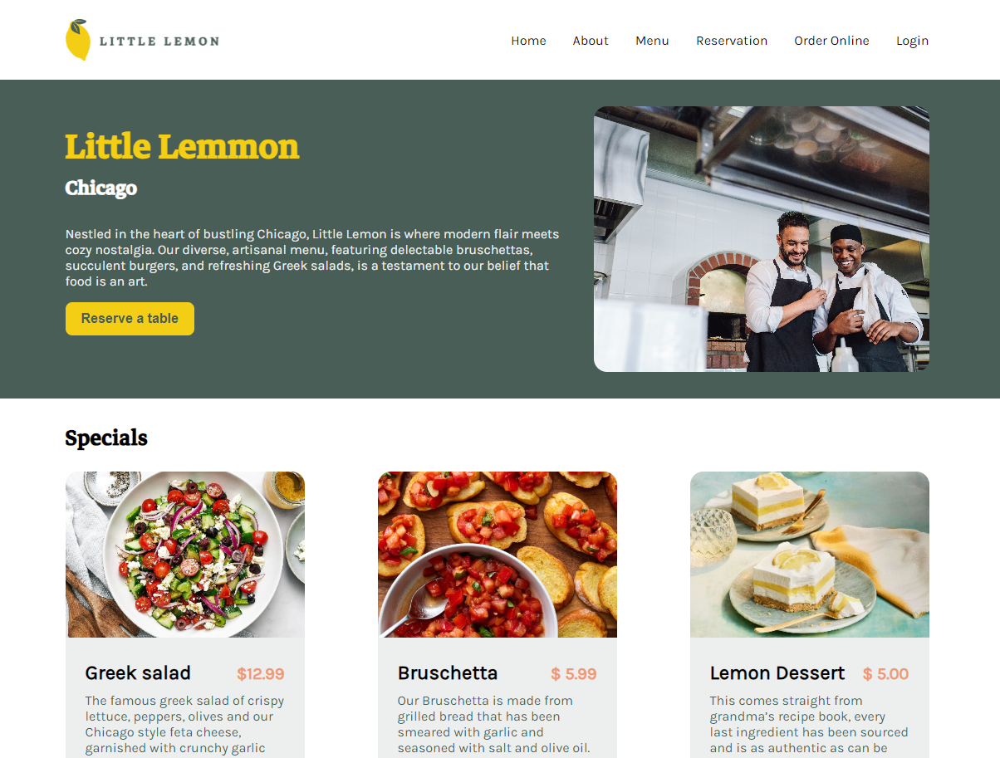

# Little Lemon 🍋

Welcome to the Little Lemon Restaurant website repository! This project was created as part of the Meta Frontend Developer course. It’s built with React and provides a stylish interface for users to explore the restaurant’s menu and make reservations.

## Live Preview

Check out the live version of the website! [View Live Demo](https://little-lemon-gilt.vercel.app/)

## Features

- Smooth navigation between pages.
- Stylishly explore the restaurant's menu.
- Make a reservation using an interactive form.
- Receive reservation confirmation through a popup.
- Built with React for a modern, interactive user experience.

## Available Scripts

In the project directory, you can run:

### `yarn install`

The `yarn install` command is used to install all the dependencies defined in your project's package.json file.

### `yarn start`

Runs the app in development mode.\
Open [http://localhost:5173](http://localhost:5173/) to view it in your browser.

### `yarn test`

Launches the test runner in interactive watch mode.
It runs all the tests for the application and provides feedback on their status.

The test files are typically located in a directory named **tests** or have a .test.js or .spec.js extension.
